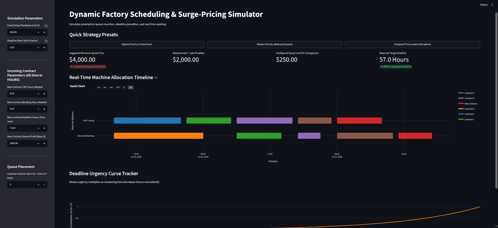
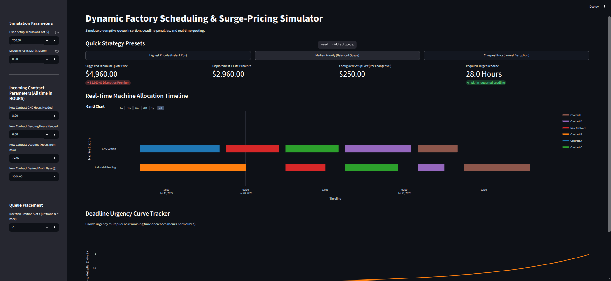
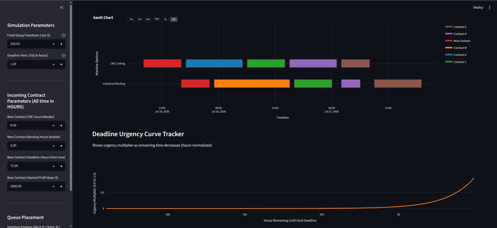

## OpCost Dashboard

OpCost Dashboard is an interactive, data-driven factory scheduling and surge-pricing simulator. Built with Python, Streamlit, and Plotly, it enables precision quote generation for custom metal fabrication environments featuring non-interchangeable, single-threaded machinery (such as CNC cutting and industrial bending lines).

Rather than relying on static estimations or rigid classification loss metrics like Cross-Entropy, OpCost Dashboard calculates the true Opportunity Cost of job preemption.

By modeling contract-splitting pipelines and time-dependent deadline penalties, it determines the exact "surge premium" required to insert a new project anywhere into an active workflow.

---





---

## i. Key Architectural Features

* Preemptive Task Routing: Treats contracts as decoupled manufacturing steps. For instance, a part can undergo CNC processing and wait in queue for bending without locking up both machines simultaneously.

* Granular Setup Overheads: Tracks and charges for the physical reality of tearing down and resetting machine fixtures if a contract is split or interrupted.

* Non-Linear Deadline Disruption: Employs a customizable exponential decay penalty curve. If an inserted contract pushes an existing contract past its delivery threshold, the dashboard automatically incorporates the displaced value into the suggested quote.

* Interactive Squeeze-to-Fit Simulation: Move sliders to slip a new contract into any slot on the timeline and see changes in machine schedules and final pricing instantly.


## ii. Mathematical Formulation

The dashboard operates on two primary mathematical engines: Urgency Allocation and Displacement Pricing.

---

## 1. The Exponential Urgency Function

Standard sigmoidal scaling functions plateau at both extremes, failing to capture the escalating panic of approaching production deadlines. This dashboard utilizes an Exponential Decay-to-Infinity curve to calculate an instantaneous urgency multiplier ($U$) based on remaining lead time ($t_{\text{left}}$) and an adjustable panic coefficient ($k$):

$$
U(t) = e^{-k \cdot \max(0.01, \, t_{\text{left}})}
$$ 

Where:

* $t_{\text{left}}$ is the number of days remaining until the contractual hard deadline.

* $k$ is the Panic Dial (the steepness of the curve). High values maintain low urgency early on, then spike sharply right before delivery.

* $\max(0.01, \cdot)$ prevents mathematical division-by-zero errors or infinite values if the simulation window reaches the deadline.

## 2. Displaced Priority Value

Every contract currently on the floor holds an implicit "holding cost value" based on its base margin ($P_{\text{base}}$) scaled by its current urgency metric:

$$
\text{Priority Value} = P_{\text{base}} \cdot U(t)
$$ 

## 3. Breakthrough Pricing Engine

The minimum viable quote ($\text{Quote}_{\text{new}}$) for an incoming contract is calculated by aggregating its desired profit base with the total economic friction it causes across your entire operation:

$$ \text{Quote}_{\text{new}} = P_{\text{new}\_\text{base}} + \sum (\text{Displaced Priority Values}) + \sum (\text{Triggered Setup Costs}) $$

* Displaced Priority Values: Activated only if inserting the new job forces an existing baseline contract to miss its delivery date.
* Triggered Setup Costs: Assessed every time a machine must switch between different contract specifications ($C_{\text{setup}}$).

------------------------------
## Logic Flow and Scheduling Architecture
The simulation engine converts data structures into a live physical execution timeline using the following logic loop:
```
[Incoming Contract Input]
         │
         ▼
[Inject into Queue Matrix via Slot Slider Index]
         │
  ┌──────┴────────────────────────────────────────┐
  ▼ ▼
[CNC Machine Pipeline] [Bending Machine Pipeline]
  │ │
  ├──► Check for Job Switch? ├──► Check Dependencies? (CNC Completed?)
  │ ├──► Yes: Add 1-Hr Setup Time │ ├──► Yes: Process Immediately
  │ └──► No: Process Straight Away │ └──► No: Sleep Task until CNC Finish
  │ │
  └──► Log Timestamp └──► Check Job Switch?
                                                        ├──► Yes: Add 1-Hr Setup Time
                                                        └──► No: Process Straight Away
                                                          │
                                                          ▼
                                            [Evaluate Final Deliveries]
                                                          │
                                                          ▼
                                            [Breach Check vs Hard Deadlines]
                                                          │
                                                          ▼
                                            [Render Suggested Quote Output]
```

------------------------------

## Step-by-Step Installation and Deployment
Follow these steps to clone and run the dashboard locally.

## Prerequisites
Make sure you have Python 3.8+ installed on your system.

## 1. Clone the Repository

git clone https://github.com/paxdriver/OpCost
cd OpCost

## 2. Set Up a Virtual Environment (Recommended)
This keeps your global python packages isolated and clean.

# MacOS/Linux
python3 -m venv venv
source venv/bin/activate

# Windows
python -m venv venv
.\venv\Scripts\activate

## 3. Install Dependencies
Install the required dashboard runtime libraries via pip:

pip install streamlit plotly numpy

## 4. Create the Application File
Ensure your primary script is saved as app.py in the root folder directory.

## 5. Launch the Dashboard Server
Execute the Streamlit application runner script in your terminal window:

streamlit run app.py

--- 
After executing, your terminal will provide a local web address (usually http://localhost:8501). Open this link in any browser to interact with the system.
------------------------------

## How to Use the Dashboard

   1. Adjust Operational Parameters: Use the top sidebar sliders to define your factory's base setup cost penalties and set the global Panic Dial ($k$).
   
   2. Input Incoming Project Specs: Specify the exact raw manufacturing hours required for both the CNC cutting and bending operations, along with the client's requested deadline window.
   
   3. Move the Placement Slider: Move the "Insert New Job After Existing Job #" slider to test different scheduling scenarios:
        
        - Setting it to 0 pushes the contract to the front of the line, maximizing displacement premiums.
        
        - Shifting it to higher values moves the project further down the queue, allowing you to find a point where the job fits without causing penalties.
   
   4. Read Your Dynamic Quote: Check the top metrics bar to review the final breakdown: the baseline profit, setup overheads, and the target price quote.
